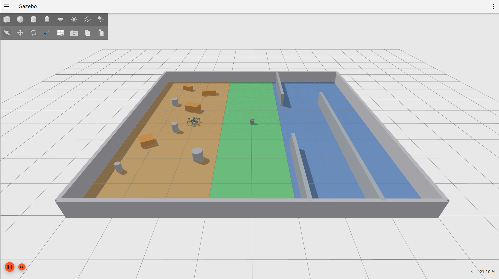
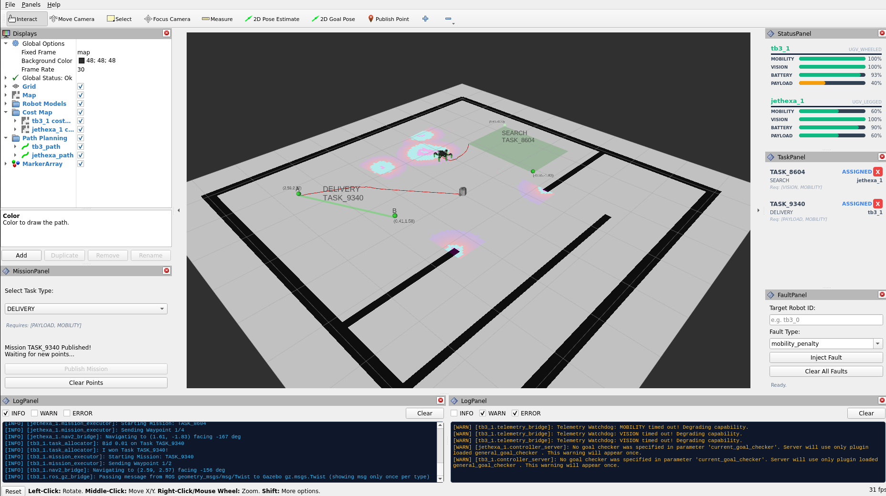

# CHROMA Framework


**Capability-aware Heterogeneous Robot Operations and Mission Allocation (CHROMA)** is a thesis project focused on the design and implementation of a capability-aware, decentralized, and resilient heterogeneous swarm framework for **Urban Search and Rescue (USAR)** scenarios.

In high-stakes USAR missions, robots frequently face environmental hazards, structural occlusions, battery drain, and hardware failures. Traditional multi-robot systems rely on static assumptions about what a robot can do. CHROMA introduces a **Dynamic Capability Model**, enabling heterogeneous robots (wheeled, legged, aerial) to continuously evaluate and broadcast their real-time operational health. This allows the swarm to autonomously coordinate, adapt to partial failures, and reallocate tasks on the fly without relying on a centralized controller.

## Tech Stack & Hardware

- **Middleware**: ROS 2 Humble
- **Simulator**: Gazebo / Ignition Fortress
- **UI/Dashboard**: NiceGUI (Python), RViz2 Plugins (C++/Qt5)
- **Hardware Platforms Used**:
  - Turtlebot3 Burger
  - HiWonder JetHexa

## Demo





## System Architecture

CHROMA is designed with strict separation of concerns, ensuring hardware-agnostic decision making and decentralized resilience. The framework is divided into four primary layers:

- **High-Level Intent & Configuration (`chroma_dashboard`, `chroma_bringup`)**: The operator entry point. Includes the web dashboard and RViz panels for dispatching missions and injecting faults, alongside YAML-driven hardware profiles that define a robot's base capabilities and degradation thresholds.
- **Global Swarm Bus (`chroma_interfaces`)**: A completely decentralized, event-driven communication layer. Robots broadcast normalized health scores and conduct distributed task auctions without a master node.
- **Decision Logic (`chroma_core`)**: Pure, hardware-agnostic mathematics. Handles task eligibility checks, heuristic bidding, and decomposes abstract mission areas into discrete geometric waypoints.
- **Hardware Abstraction (`chroma_bridges`)**: The translation layer. Converts high-level waypoints into specific kinematic commands (e.g., Nav2 goals or legged gait control) and monitors raw sensor topics via watchdogs to infer subsystem health.
- **Physical Execution (`chroma_simulation`)**: The physical or simulated hardware layer containing Gazebo environments, URDFs, and physical actuators, allowing new robot topologies to be hot-swapped seamlessly into the swarm.


## Installation & Setup (Pixi)

This project uses [Pixi](https://pixi.sh) and [Robostack](https://robostack.github.io) to manage its ROS 2 environment. This ensures all dependencies (including ROS 2 Humble) are installed in an isolated project folder, avoiding conflicts with the system.

### Install Pixi

If you don't have Pixi installed, run:

```bash
curl -fsSL https://pixi.sh/install.sh | bash
```

Then check if Pixi installed successfully:

```bash
pixi --version
```

### Install Project Dependencies

Navigate to workspace folder and install all required packages

```bash
pixi install
```

_Note: This will download ROS 2 and all dependencies into the `.pixi/` folder._

### Build the Workspace

Always run commands using the `pixi run` prefix to ensure the virtual environment is used

```bash
pixi run colcon build --symlink-install
```

> **Warning**: Do NOT source `/opt/ros/humble/setup.bash` while using this project. Doing so will cause environment leakage and build errors. Please remove it from `.bashrc` before building.

### Shell Activation

If you prefer a standard terminal workflow where you don't have to type `pixi run` every time, you can enter the isolated shell

```bash
pixi shell
# You are now inside the environment
ros2 launch ...
```

## Configuration

Swarm compositions and robot capabilities are defined entirely via YAML files located in the `chroma_bringup/config/` directory. This decoupled approach allows heterogeneous robots to join the swarm without requiring any changes to the core Python or C++ code.

### Robot Profiles

A **Robot Profile** acts as the genetic makeup of a specific robot model (e.g., a TurtleBot3 or a JetHexa). It defines what hardware the robot possesses, how easily that hardware breaks, and how its telemetry maps to the global swarm bus.

Example: `chroma_bringup/config/tb3_profile.yaml`

```yaml
/**:
  ros__parameters:
    robot_type: 'UGV_WHEELED'
    model_name: 'turtlebot3_burger'

    # The baseline health score (0.0 to 1.0)
    capabilities:
      MOBILITY: 0.6
      VISION: 0.5
      BATTERY: 1.0
      PAYLOAD: 0.4

    # Degradation thresholds
    thresholds:
      MOBILITY: 0.3
      VISION: 0.3
      BATTERY: 0.15

    # Multipliers for fault injections
    fault_impacts:
      mobility_failure: 0.0
      mobility_penalty: 0.4

    # Nav2 execution interface overrides
    nav2:
      enabled: true
      use_sim_time: true
      map_yaml: 'usar_map.yaml'
      params_file: 'nav2_tb3.yaml'
      initial_pose:
        x: 0.0
        y: 0.0
        yaw_degrees: 0.0

    # Telemetry interface overrides
    telemetry:
      has_battery: false
      drain_rate_idle: 0.0005
      drain_rate_active: 0.002

      watchdogs:
        topics: ['odom', 'scan']
        types: ['nav_msgs.msg.Odometry', 'sensor_msgs.msg.LaserScan']
        capabilities: ['MOBILITY', 'VISION']
        reliability: ['reliable', 'best_effort']
        timeouts: [2.0, 2.0]
```

### Swarm Configuration

The swarm_config.yaml file located in `chroma_simulation/config/` dictates the simulation environment. It defines exactly how many robots spawn, what types they are, and where they are placed.

To keep the file clean, it heavily utilizes YAML Anchors and Aliases. This allows the definition complex ROS-Ignition bridge routes once, and applies them automatically to every robot of that type.

Example:

```yaml
swarm:
  tb3_1:
    <<: *tb3_template
    urdf: 'turtlebot3/robot.urdf.xacro'
    config: 'tb3_sim_profile.yaml'
    x: 0.0
    y: 0.0
    yaw: 0.0

  tb3_2:
    <<: *tb3_template
    urdf: 'turtlebot3/robot.urdf.xacro'
    config: 'tb3_sim_profile.yaml'
    x: -1.0
    y: 1.0
    yaw: 1.57

  jethexa_1:
    <<: *jethexa_template
    urdf: 'jethexa/robot.urdf.xacro'
    config: 'jethexa_sim_profile.yaml'
    x: 2.0
    y: 0.0
    yaw: 0.0
```

> **Note**: The launch file will search for config files in `chroma_bringup/config/` and urdf files inside `chroma_simulation/urdf/`.

## Running the Simulation

Once the configuration is set, launching the swarm simulation in Gazebo and running the HSI dashboard uses the following commands.

#### Launch the Simulation

```bash
pixi run sim
```

#### Start the Dashboard

```bash
pixi run dash
```

#### Launch RViz with CHROMA plugins

```bash
pixi run rviz
```

## License

This project is open-sourced under the **Apache 2.0** License.
